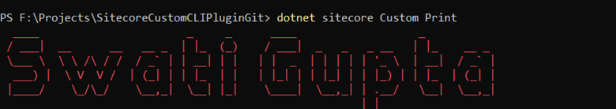
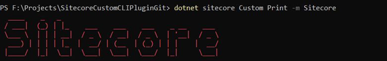

# Sitecore CLI: Extend the Command Line Interface with NuGet
Sitecore Command Line Interface (CLI) allows console communication with a Sitecore instance.  Sitecore CLI allow to add plugin command. Sitecore provides some plugin like Publishing and Serialization. 
The purpose of this blog is to create simple Sitecore CLI plugin which will print any message which you are passing in parameter or print default message. 

## Prerequisites 
- [.Net Core](https://dotnet.microsoft.com/en-us/download/dotnet/3.1)

## Usages
dotnet sitecore plugin [subcommand] [options]

## How to Run Custom CLI Plugin
- Open terminal, Run as Administrator
- Run the below command to restore
	o	dotnet tool restore
- Run below command to add your custom plugin:
	o	dotnet sitecore plugin add -n CLI.DevEx.Extensibility.Custom --version 1.0.0
- Now finally when you will run “dotnet sitecore Custom Print” command, it will print default name:

  
- You can pass some message like this “dotnet sitecore Custom print -m Sitecore”

  
	